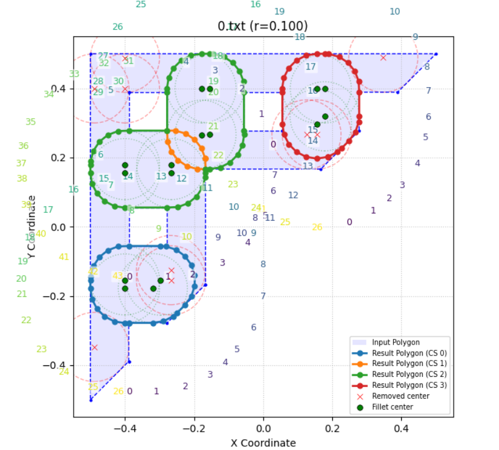

[==========] 112 tests from 1 test suite ran. (4131 ms total)
[  PASSED  ] 107 tests.
[  FAILED  ] 5 tests, listed below:
[  FAILED  ] Polygon.Fillet.Looping1
[  FAILED  ] Polygon.Fillet.Looping2
[  FAILED  ] Polygon.Fillet.Holes6
[  FAILED  ] Polygon.Fillet.Precision
[  FAILED  ] Polygon.Fillet.BigSponge

[  PASSED  ] 108 tests.
[  FAILED  ] 5 tests, listed below:
[  FAILED  ] Polygon.Fillet.Looping1
[  FAILED  ] Polygon.Fillet.Looping2
[  FAILED  ] Polygon.Fillet.ExtraTriangle
[  FAILED  ] Polygon.Fillet.Precision
[  FAILED  ] Polygon.Fillet.Sponge

TODO:

Fix Hole6 extra circle centers
Fix radius test
Fix tracing non-stop looping

9.9999999999999995e-07
0.6000008750000001

[DONE] 0.97524511924326607

ASK:

Collider will throw error if only input empty or one element.
is Collider ensure A->B and B->A without floating error?

When very short edge exist, will this cause logical error? because if two arc is at the endpoint of this short edge, order might conflict.